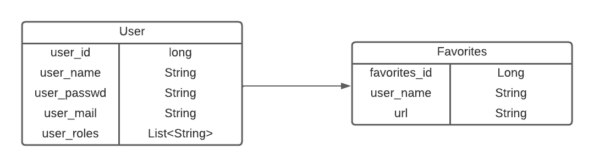

# OPA Music

## Group Members
- Pierre Bonnefoy
- Ophélie Maréchal
- Aloys Lana

## Choice of the Subject
We initially chose to realize a streaming platform for music using the Youtube 
API. However, we could not extract music from all Youtube videos, 
so the project became an alternative youtube client where you can
search every video on Youtube and add it to your favorites to keep it safe.

## Installation Instructions
### Prerequesites
You need to have installed on your laptop the following softwares :
- Java 17 JDK
- Spring Boot
- Thymeleaf 
- Maven
- Visual Studio Code with the following extensions : 
    1. “Extension Pack for Java”, vscjava.vscode-java-pack, Microsoft
    2. “Spring Boot Extension Pack”, pivotal.vscode-boot-dev-pack, Pivotal 
    3. “Lombok Annotations Support for VS Code”, vscjava.vscode-lombok, Microsoft
    4. “Vue.js Extension Pack”, mubaidr.vuejs-extension-pack, Muhammad Ubaid Raza
    5. “HTML Boilerplate”, sidthesloth.html5-boilerplate, sidthesloth
    6. “Java Code Generators”, sohibe.java-generate-setters-getters, Sohibe

### Launching Instructions
- Clone the Git Repository by using : `git clone https://github.com/UJM-INFO/2022-pwa-e.git`
- Then go to the repository where you clone : `cd 2022-pwa-e.git`
- Launch VS Code : `code .`
- Wait for VS Code to Open the Java Project
- Go to the Spring Boot Dashboard in the left menu
- Click on the Launching Button
- Open the Web Browser of your choice
- Go to the URL : `localhost:8080`
- You got it.

## System Architecture
### Entity-Association Diagram

## Actual Project State
For now, the project is not finished. We have only implemented the Spring part and we still have to do the Vue JS part to make it more dynamic.

### Already implemented features
- The Authentication System and User Database is fully finished.
- The Youtube API communication is finished.
- The Favourites System is operationnal but we want to enhance it by adding a multiplaylist system.
- The design of the application has been done (and can be change by the Vue JS implementation).

## Ressources
### Tutorials we have followed
- https://javatechonline.com/how-to-implement-security-in-spring-boot-using-userdetailsservice/
- Slides of our professor Rémi Emonet : https://learn.heeere.com/2022-pwa-2e95/
- Spring Boot Documentation : https://docs.spring.io/spring-boot/docs/current/reference/htmlsingle/
- Java Documentation : https://docs.oracle.com/en/java/
- MDN Documentation : https://developer.mozilla.org/fr/
- Google Youtube API Documentation : https://developers.google.com/youtube/v3
