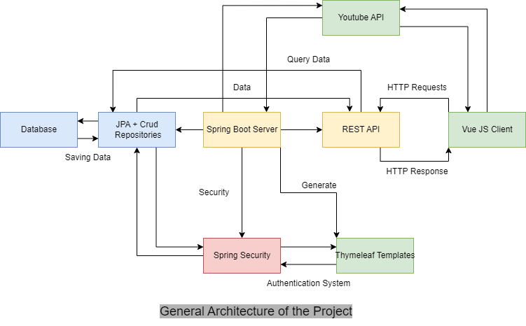

# OPA Music

## Group Members
- Pierre Bonnefoy
- Ophélie Maréchal
- Aloys Lana

## Choice of the Subject
We initially chose to realize a streaming platform for music using the Youtube 
API. However, we could not extract music from all Youtube videos, 
so the project became an alternative youtube client where you can
search every video on Youtube and add it to your favorites to keep it safe.

### Implemented Features
#### Thymeleaf Client
- Authentication System
- Video research with Youtube API
- Favorites videos saving

#### Vue JS Client
- Authentication System
- Video Research with Youtube API
- Favorites videos saving
- Playlist system to classify your favorites videos.

## Installation Instructions
### Prerequesites
You need to have installed on your laptop the following softwares :
- Java 17 JDK
- Spring Boot
- Thymeleaf 
- Maven
- Node JS 16
- NPM
- Vue JS
- Visual Studio Code with the following extensions : 
    1. “Extension Pack for Java”, vscjava.vscode-java-pack, Microsoft
    2. “Spring Boot Extension Pack”, pivotal.vscode-boot-dev-pack, Pivotal 
    3. “Lombok Annotations Support for VS Code”, vscjava.vscode-lombok, Microsoft
    4. “Vue.js Extension Pack”, mubaidr.vuejs-extension-pack, Muhammad Ubaid Raza
    5. “HTML Boilerplate”, sidthesloth.html5-boilerplate, sidthesloth
    6. “Java Code Generators”, sohibe.java-generate-setters-getters, Sohibe

### Launching Instructions
#### Thymeleaf Version
- Clone the Git Repository by using : `git clone https://github.com/UJM-INFO/2022-pwa-e.git`
- Then go to the repository where you clone : `cd 2022-pwa-e.git`
- Launch VS Code : `code .`
- Wait for VS Code to Open the Java Project
- Go to the Spring Boot Dashboard in the left menu
- Click on the Launching Button
- Open the Web Browser of your choice
- Go to the URL : `localhost:8080`
- You got it.

#### Vue JS Version
- Clone the Git Repository by using : `git clone https://github.com/UJM-INFO/2022-pwa-e.git`
- Then go to the repository where you clone : `cd 2022-pwa-e.git`
- Launch VS Code : `code .`
- Wait for VS Code to Open the Java Project
- Go to the Spring Boot Dashboard in the left menu
- Click on the Launching Button
- Now the Spring Server is launch 
- Go to the vue-app directory `cd vue-app`
- Installation of NPM required packages : `npm install`
- Launching of the Vue JS client : `npm run dev`
- Open the Web Browser of you choice
- Go to the URL : `localhost:5173`
- You got it.

## System Architecture
### Entity-Association Diagram

### Global Architecture

### Vue Architecture

## Ressources
### Tutorials we have followed
- https://javatechonline.com/how-to-implement-security-in-spring-boot-using-userdetailsservice/
- Slides of our professor Rémi Emonet : https://learn.heeere.com/2022-pwa-2e95/
- Spring Boot Documentation : https://docs.spring.io/spring-boot/docs/current/reference/htmlsingle/
- Java Documentation : https://docs.oracle.com/en/java/
- MDN Documentation : https://developer.mozilla.org/fr/
- Google Youtube API Documentation : https://developers.google.com/youtube/v3
- https://youtu.be/cceABfrGgm4
- https://www.bezkoder.com/spring-boot-vue-js-authentication-jwt-spring-security/#Front-end_with_Vuejs_038_Vuex
- https://www.youtube.com/watch?v=xfuIkI2C8-o
- https://stackabuse.com/conditional-rendering-in-vue-with-v-if-v-show-v-else-and-v-else-if/
